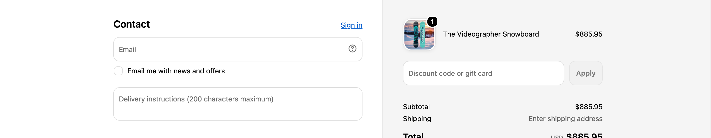

<p align="right"><a href="README.fr.md">Lire en français</a></p>

# Shopify Delivery Note

A checkout field that lets the buyer leave delivery instructions — a gate code, "ring
the neighbour" — and stores them on the order where the merchant will actually read
them.

Built as an **extension-only** app: one checkout UI extension, no server, no hosting.
It renders inside Shopify's checkout and writes to a cart attribute through the
supported Attributes API.




## The problem

Buyers have information the merchant needs and no place to put it. They write it in the
wrong field, email it after the fact, or don't send it at all — and the parcel comes
back.

The obvious fix used to be editing `checkout.liquid`. That door is closed, and the rest
of this README explains why that's a good thing.

## How it works

The extension targets `purchase.checkout.block.render`, a **block target**: the merchant
positions it anywhere in checkout using the checkout editor. The app recommends
`DELIVERY2` — below the shipping methods — through `default_placement`, but the final
position belongs to the merchant.

The buyer types; the value is written to the `noteLivraison` cart attribute and appears
under **Additional details** on the order.

Writing is debounced at 500 ms, with a flush when the field loses focus. Per keystroke
would mean a burst of network calls; on blur alone, a buyer who types and clicks
straight through to payment would lose what they wrote.

### The three write branches

Input is trimmed before anything is decided:

| Trimmed input | Action |
| --- | --- |
| Has content | `updateAttribute` |
| Empty, attribute exists | `removeAttribute` |
| Empty, nothing stored | No call |

The middle branch matters more than it looks. Without it, a buyer who clears the field
would still ship an order carrying the old instructions — they'd believe they had
removed them, and the packer would keep reading them. The third branch is why three
spaces don't create an invisible attribute that reads as a filled-in field.

### Two defences, two different causes

**The checkout configuration forbids attribute writes** — `canUpdateAttributes` is
false. The component renders nothing. A field that silently discards what you type is
worse than no field.

**The instruction says yes and the write still fails.** The shipped schema is explicit:

> Even when `true`, calls to `applyAttributeChange()` can still fail during accelerated
> checkout (Apple Pay, Google Pay).

So gating on the instruction is not enough. When a write is refused, the failure is
surfaced on the field itself through the `error` prop, which styles the field *and*
announces the message to screen readers.

This second path could not be reproduced during testing — Shop Pay writes fine, and
Apple Pay and Google Pay aren't testable on a development store. **It is code written
without having observed the failure**, on the strength of the schema. A comment at the
top of the source says so, so nobody removes it as dead code.

## Why not `checkout.liquid`

Shopify Plus merchants once had a `checkout.liquid` template they could edit like any
other theme file. It is deprecated, and the reasons are worth stating plainly — they
explain the shape of everything above.

**Shopify couldn't ship anything.** A checkout whose markup had been rewritten by hand
can't be updated without risking someone's store. Every platform improvement waited on
every merchant to adapt their file.

**Security and compliance couldn't be guaranteed.** A payment page assembled from
arbitrary merchant code is a payment page nobody can certify.

**Upgrades were the merchant's problem.** New payment methods, accessibility fixes,
localisation — all of it had to be re-implemented per store.

Checkout Extensibility inverts the contract: Shopify owns the page, apps supply
components at defined points. The merchant can't break the checkout, Shopify can evolve
it, and the extension keeps working.

The price is real and visible in this codebase. **No arbitrary CSS**, no custom markup —
the field is an `s-text-area` and it looks like the rest of the checkout because it
isn't ours to style. **No arbitrary position** — the merchant places the block.
**No arbitrary APIs** — attributes are written through a supported method that can and
does refuse. Those constraints are the reason the extension survives a checkout upgrade
that would have broken a Liquid template.

## Merchant setup

Two settings silently remove the field. Neither produces an error, and both belong in
any handover document.

**"Include app in Shop Pay"** — off by default, in the block's settings in the checkout
editor. Left off, Shop Pay orders collect no delivery instructions at all.

**Block placement** — the field exists only where the merchant puts it. Removing the
block removes the feature.

One more thing worth knowing: nothing prevents a merchant from placing the same block
twice, which shows two identical fields writing to the same key. The data stays correct
— last write wins — but it's confusing. Guarding against it in code would mean
instances claiming ownership through the cart, which is racy, pollutes order data, and
in the worst case would leave the buyer with no field at all. Trading a visible
annoyance for a silent failure is a bad deal, so the block count is left to the merchant.

## Deliberate trade-offs

**The attribute key is not namespaced.** Shopify's documentation recommends prefixing
keys to avoid collisions between extensions. `noteLivraison` isn't prefixed: the
alternative put an organisation name into permanent order data, on a public repository,
and a merchant reading `noteLivraison` in the admin understands it. The collision risk
is accepted.

**An attribute, not the order note.** The note is a single shared field — any other app
writing to it collides. A named key doesn't. The visibility cost turned out to be much
smaller than assumed: **Additional details** sits directly under **Notes** in the order
sidebar, not buried further down.

**No merchant alert when a write fails.** The app is extension-only, with no server,
so nothing can report an anomaly. A note that fails to save is indistinguishable from
an order that never had one. This is an architectural constraint, not an oversight.

## What isn't covered

- Apple Pay and Google Pay were never exercised — no wallet available on a development
  store. The accelerated-checkout failure path is plausible and unobserved.
- No pricing logic. A paid option — gift wrapping, for instance — needs a Function or a
  cart transform, not this.
- No blocking validation. The field never prevents checkout from completing.

## Local development

```shell
shopify app dev
```

For a block target, append `?placement-reference=DELIVERY2` to the checkout URL to
preview a specific placement without touching the editor.

Note that a development preview and a block placed in the editor both inject the
extension, so the field appears twice while `shopify app dev` is running. Deploy once
and the duplicate disappears.

```shell
shopify app deploy
```

## Stack

Preact, `@shopify/ui-extensions` 2026.7, API version 2026-07. No server, no third-party
dependencies.
